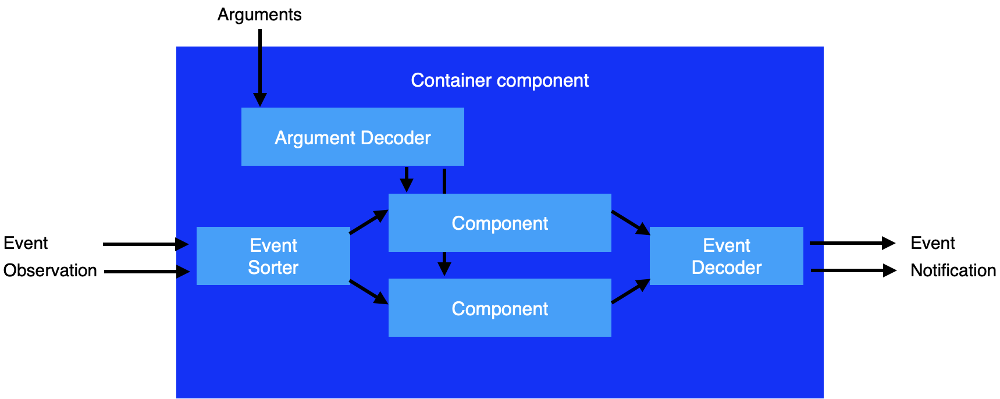

# Components
## Introduction
The `component` is software module which implemented in application software. In usually, the module will be mapped to the GUI widget.


The component has following interface:
|Name       |Description                                    |
|:--        |:--                                            |
|argument   |The static parameters to initialze the component.      |
|action     |Input by the user. The click, key press and so on. |
|event      |Send message to the method of another component. |
|notification   |Send notification which tells some property in the componet is updated. |
|observation    |Receive the notification from the other component. |

The component can have multiple components in it.
(It is called as `container component`.)
The window view is presented by the hierarchy of the components.



## Description of component
### Base
Following contents are defined for a component.
* _Class name_: Each component has unique class name
* _Properties_: Variables to hold the property values
* _Methods_: JavaScript function to implement functions of the component

The component is described by [Extended JavaScript Object Notation](https://github.com/steelwheels/KiwiScript/blob/master/KiwiLibrary/Document/Data/object-notation.md).

### Instance and class name
````
instance-name: {
    class:  "class-name"
}
````

### Normal method
````
{
    func_a:  func(a, b, c)  %{
        return a + b + c ;
    %}
}
````

### Listner method
````
{
    listner_a: listen(a.b.c) %{
        self.a = a.b.c + 1 ;
    %}
}
````

## Implementations
### GUI widget
* [button](Components/button.md): Pressable button.
### Alert
* [alert](Components/alert.md): Modal alert

## Related links
* [README](https://github.com/steelwheels/KiwiCompnents): Top page of KiwiComponents project.
* [Steel Wheels Project](https://steelwheels.github.io): Developer's web site
