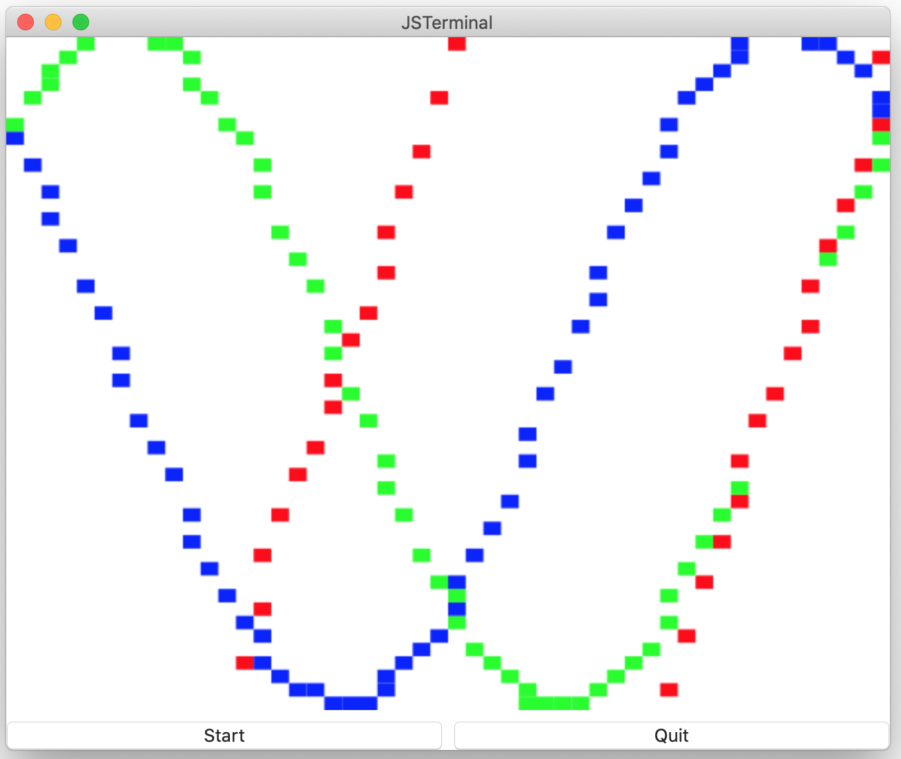

# Bitmap component
The 2D bitmap drawer.  The [bitmap context](https://github.com/steelwheels/KiwiScript/blob/master/KiwiLibrary/Document/Class/BitmapContext.md) is used to set/get pixel in the bitmap. The `draw` method is called to draw/update the bitmap. It is called periodically. The calling is controlled by `start`, `stop`, `suspend`, `resume` methods.

## Sample script
````
top: VBox {
    bitmap: Bitmap {
        width:          Int     640
        height:         Int     480
        rowCount:       Int     50
        columnCount:    Int     50

        draw: Event(context, count) %{
            ... Update context ...
        %}
    }
    buttons: HBox {
        start_button: Button {
            pressed: Event() %{
                let grp = top.bitmap ;
                // Get the state of graphics drawing
                switch(grp.state) {
                    case AnimationState.idle:
                        // Start drawing
                        grp.start(1.0, 10.0) ;
                    break ;
                    case AnimationState.run:
                        grp.stop() ;
                    break ;
                    case AnimationState.pause:
                        console.print("No effect\n") ;
                    break ;
                }
            %}
        }
    }
}
````


You can see the full implementation at [bitmap.jspkg](https://github.com/steelwheels/JSTerminal/tree/master/Resource/Sample/bitmap.jspkg).


## Properties

|Property name  |Type       |Description        |
|:--            |:--        |:--                |
|width          |number     |The width of view |
|height         |number     |The height of view  |
|rowCount       |number     |The number of pixels on the row of bitmap |
|columnCount    |number     |The number of pixels on the column of bitmap |
|status         |[AnimationState](https://github.com/steelwheels/KiwiScript/blob/master/KiwiLibrary/Document/Enum/AnimationState.md)     |The state of animation. (Read only) |


## Methods
### `start` method
Call this method to start context drawing.
````
start(duration:number, repeat:number) %{
        ...
%}
````
|Parameter name |Type       |Description        |
|:--            |:--        |:--                |
|duration       |number     |The interval for each animation frames. You can give floating point value. The unit is second. |
|repeat         |number     |Integer number to present repeat counts. |

### `stop` method

### `suspend` method

### `resume` method

### `draw` event function
The event function which is called when to draw the graphics.

````
{
    draw: Event(context, )
}
````

|Parameter name |Type   |Description                    |
|:---           |:---   |:---                           |
|context        |[GraphicsContext](https://github.com/steelwheels/KiwiScript/blob/master/KiwiLibrary/Document/Class/GraphicsContext.md)  |The interface object to draw 2D graphics  |

The parameter `context` is an instance of [GraphicsContext class](
https://github.com/steelwheels/KiwiScript/blob/master/KiwiLibrary/Document/Class/GraphicsContext.md).

## Built-in method
Following methods are defined as built-in method. 
You can call them in your JavaScript code:

### `start`
````
grp.start(interval: Double, endtime: Doble) ;
````
Start the animation. The `interval` is the period of the animation. And the `endtime` is time to run the animation.

### `stop`
Stop the animation. All status (such as state, repeat count) will be initialized for next `start`.
````
grp.stop() ;
````

### `suspend`
Suspend the animation. The status is freezed until `resume` or `stop` method is called.
````
grp.suspend() ;
````
Suspend the animation. It can be resumed by `resume` method.

### `resume`
Resume the animation. This method is used to restart animation which is suspended by `suspend` method.
````
grp.resume() ;
````
Resume the suspende anumation.

## Reference
* [Bitmap context](https://github.com/steelwheels/KiwiScript/blob/master/KiwiLibrary/Document/Class/BitmapContext.md): The bitmap to draw the 2D bitmap graphics. 
* [Library](https://github.com/steelwheels/KiwiCompnents/blob/master/Document/Library.md): The list of components. 
* [README](https://github.com/steelwheels/KiwiCompnents): Top page of KiwiComponents project.
* [Steel Wheels Project](https://steelwheels.github.io): Developer's web site


