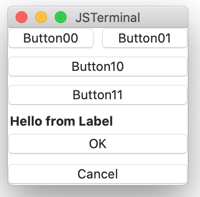

# VBox, HBox, LabeledBox
Container of multiple child components.

## Sample
````
top: VBox {
        h_box: HBox {
                button00: Button {
                        title:  String          "Button00"
                        pressed: Event() %{ console.print("pressed: 00\n") ; %}
                }
                button01: Button {
                        title:  String "Button01"
                        pressed: Event() %{ console.print("pressed: 01\n") ; %}
                }
        }
        v_box: VBox {
                title:          String          "Button10"
                distribution:   Distribution    fill
                ok_button: Button {
                        title:  String "Button10"
                        pressed: Event() %{ console.print("pressed: 10\n") ; %}
                }
                calcel_button: Button {
                        title:  String "Button11"
                        pressed: Event() %{ console.print("pressed: 11\n") ; %}
                }
        }
        l_box: LabeledBox {
                title:          String          "Hello from Label"
                ok_button: Button {
                        title:  String "OK"
                        pressed: Event() %{ leaveView(0) ; %}
                }       
                calcel_button: Button {
                        title:  String "Cancel"
                        pressed: Event() %{ leaveView(1) ; %}
                }
        }
}
````



You can find the full implementation at [Box.jspkg](https://github.com/steelwheels/JSTerminal/tree/master/Resource/Sample/box.jspkg).

### Properties
|Name   |Type       |Description        |
|:--    |:--        |:--                |
|title  |string     |Label of the button |
|axis   |[Axis](https://github.com/steelwheels/KiwiScript/blob/master/KiwiLibrary/Document/Enum/Axis.md)   |The axis to place child components. The VBox has `vertical` and the HBox has `horizontal`.|
|alignment |[Alignment](https://github.com/steelwheels/KiwiScript/blob/master/KiwiLibrary/Document/Enum/Alignment.md) |The alignment of child cmponents. The HBox and VBox has different identifiers. |
|distribution |[Distribution](https://github.com/steelwheels/KiwiScript/blob/master/KiwiLibrary/Document/Enum/Distribution.md) | The type of space between the box and child components. |


## Related links
* [Library](https://github.com/steelwheels/KiwiCompnents/blob/master/Document/Library.md): The list of components. 
* [README](https://github.com/steelwheels/KiwiCompnents): Top page of KiwiComponents project.
* [Steel Wheels Project](https://steelwheels.github.io): Developer's web site
