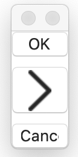

# Button component
The button to be pressed.

````
top: VBox {
    ok_button: Button {
        title:     String "OK"
        isEnabled: Bool  true
        pressed: Event() %{
                console.log("pressed: OK") ;
                leaveView(1) ;
        %}
    }
    arrows_button: Button {
        title:     String "->"
        isEnabled: Bool  true
        pressed: Event() %{
                console.log("pressed: right arrow") ;
                leaveView(1) ;
        %}
    }
    cancel_button: Button {
        title:  String "Cancel"
        isEnabled: Bool  true
        pressed: Event() %{
                console.log("pressed: Cancel") ;
                leaveView(0) ;
        %}
    }
}

````

You can see the full implementation at [buttons.jspkg](https://github.com/steelwheels/JSTerminal/tree/master/Resource/Sample/buttons.jspkg).



## Properties

|Property name  |Type       |Description        |
|:--            |:--        |:--                |
|title          |string     |Label of button    |
|isEnabled      |boolean    |Activate/inactivate the button |

Some title string will be replaced by the symbol. It is called *special title*.

|Special title  |Image          |
|:--            |:--            |
|"<-"           |Left arrow     |
|"->"           |Right arrow    |

## Methods
### `pressed` event
This method will be called when the button is pressed by the user.
````
pressed: Event() %{
        ... event processing ...
%}
````

## Reference
* [Library](https://github.com/steelwheels/KiwiCompnents/blob/master/Document/Library.md): The list of components. 
* [README](https://github.com/steelwheels/KiwiCompnents): Top page of KiwiComponents project.
* [Steel Wheels Project](https://steelwheels.github.io): Developer's web site


