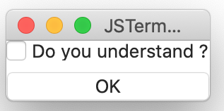

# CheckBox component
The check box to toggle ON/OFF value.

## Samble screen shot


You can see the entire script at [checkbox.jspkg](https://github.com/steelwheels/JSTerminal/tree/master/Resource/Sample/checkbox.jspkg).

## Interface
````
interface: Checkbox {
        status:         boolean
        isEnabled:      boolean
        title:          string

        event pressed(): void
}
````

## Properties
|Property name  |Type       |Description        |
|:--            |:--        |:--                |
|status         |bool       |The status of checkbox. True: checked, False: Not checked. |
|title          |string     |The label of the checkbox |
|isEnabled      |boolean    |Activate/inactivate check box |

## Methods
### `pressed` method
````
pressed: Event() %{
        ...
%}
````

## Reference
* [Library](https://github.com/steelwheels/KiwiCompnents/blob/master/Document/Library.md): The list of components. 
* [README](https://github.com/steelwheels/KiwiCompnents): Top page of KiwiComponents project.
* [Steel Wheels Project](https://steelwheels.github.io): Developer's web site


