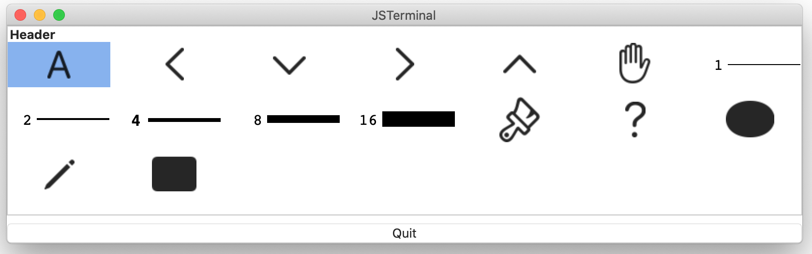

# Collection view component
The collection view is used to display multiple arranged images. The image can be selected by the user. 

The context of the view is defined as an instance of [Collection](https://github.com/steelwheels/KiwiScript/blob/master/KiwiLibrary/Document/Class/Collection.md) class.

## Sanple
````
top: VBox {
        collection: CollectionView {
                init: Init %{
                        let col0 = Collection();
                        let paths = [
                                Symbols.characterA,
                                ....
                                Symbols.rectangle(true, true)
                        ];
                        col0.add("Header", "Footer", paths);
                        self.store(col0) ;
                %}
                selected: Event(section, item) %{
                        console.log("selected: " + section + ", " + item) ;
                        console.log("itemCount: " + self.itemCount(section));
                %}
        }
        ...
}
````

This is the screenshot of this component:


In the above example, the instance of [Collection](https://github.com/steelwheels/KiwiScript/blob/master/KiwiLibrary/Document/Class/Collection.md) class is allocated in `Init` method and stored by `store` method.

You can see the entire script at [collection1.jspkg](https://github.com/steelwheels/JSTerminal/tree/master/Resource/Sample/collection1.jspkg).

## Properties
|Property name  |Type   |Description        |
|:--            |:--    |:--                | 
|sectionCount   |number |Number of sections in the collection |
|isSelectable   |Bool   |User can select an item or not|

## Method

### `itemCount`
````
itemCount(secno: number): number
````
Return the count of items in the specified section by argument `secno`.
If the argument is not valid or there are no matched section, the return value will be 0.

### `selected` method
````
selected: Event(section, item) %{
%}
````

|Property name  |Type   |Description        |
|:--            |:--    |:--                | 
|section        |number |Section number of clicked cell |
|item           |number |Item number of clicked cell |

### `store` method
In usually, this method is called in the function.
````
init: Init %{
        self.store(db) ;
%}
````

|Property name  |Type   |Description        |
|:--            |:--    |:--                | 
|db             |[Collection](https://github.com/steelwheels/KiwiScript/blob/master/KiwiLibrary/Document/Class/Collection.md) |The database of collection data |

# Reference
* [Library](https://github.com/steelwheels/KiwiCompnents/blob/master/Document/Library.md): The list of components. 
* [README](https://github.com/steelwheels/KiwiCompnents): Top page of KiwiComponents project.
* [Steel Wheels Project](https://steelwheels.github.io): Developer's web site
