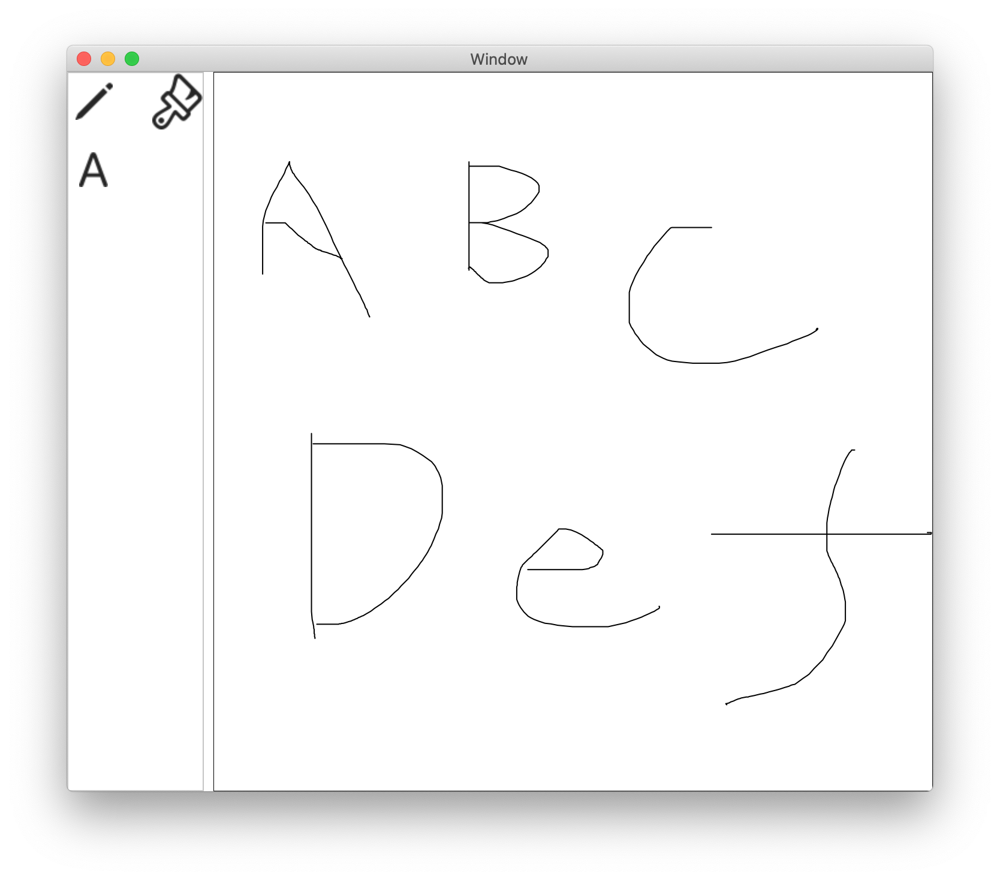

# Drawing view component
The drawing view gives the canvas to user to draw vector graphics. 

## Sample
````
top: VBox {
  drawing: DrawingView {
    width:  Float 400.0
    height: Float 400.0
  }

  buttons: HBox {
    load: Button {
    title: String "Load"
    pressed: Event() %{
      let url = openPanel("Load vector graphics",
        FileType.File,
        ["json"]) ;
      if(url != null){
        // Load the vector graphics definition file
        top.drawing.load(url) ;
      }
    %}
  }

  store: Button {
    title: String "Store"
    pressed: Event() %{
      let url = savePanel("Save vector graphics") ;
      if(url != null){
        // Save the vector graphics thar user drawn,
        top.drawing.store(url) ;
      }
    %}
  }
  ....
}
````

This is the screenshot of this component:


You can see the entire script at [drawing.jspkg](https://github.com/steelwheels/JSTerminal/tree/master/Resource/Sample/drawing.jspkg).

## Property values
|Property name  |Type   |Description        |
|:--            |:--    |:--                | 
|width   |Double  |Width of drawing area [pixels] |
|height  |Double  |Height of drawing area [pixels] |

## Method
### `load` method
````
load(url: URL) ; 
````
|Parameter name  |Type   |Description        |
|:--            |:--    |:--                | 
|url |[URL](https://github.com/steelwheels/KiwiScript/blob/master/KiwiLibrary/Document/Class/URL.md) |The URL of the file which contains the vector graphics description. |

### `store` method
````
store(url: URL) ; 
````
|Parameter name  |Type   |Description        |
|:--            |:--    |:--                | 
|url |[URL](https://github.com/steelwheels/KiwiScript/blob/master/KiwiLibrary/Document/Class/URL.md) |The URL of the file to write the current vector graphics. |

# Reference
* [Library](https://github.com/steelwheels/KiwiCompnents/blob/master/Document/Library.md): The list of components. 
* [README](https://github.com/steelwheels/KiwiCompnents): Top page of KiwiComponents project.
* [Steel Wheels Project](https://steelwheels.github.io): Developer's web site
