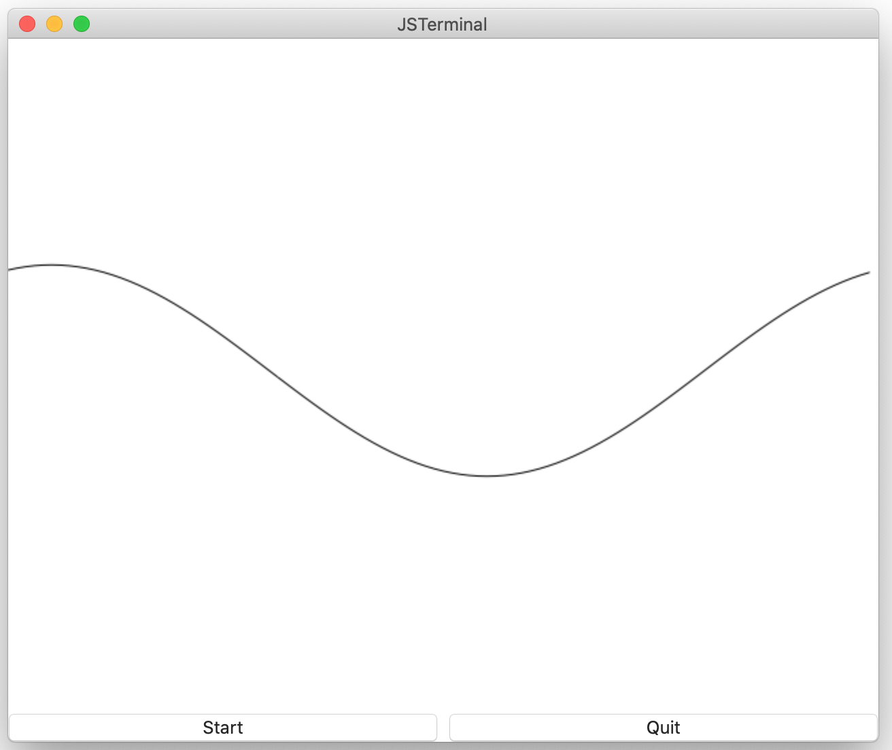

# Graphics 2D component
The 2D graphics drawer.  

## Sample
````
top: VBox {
  graphics: Graphics2D {
    width:      Int         640
    height:     Int         480
    xSize:      Float       6.28
    ySize:      Float       6.28
    xOrigin:    Float       -3.14
    yOrigin:    Float       -3.14
    draw: Event(context, count) %{
            ....
            /* Move to first position */
            context.moveTo(minx, Math.sin(minx + offset)) ;
            /* Draw sin curves */
            for(let x=minx ; x<=maxx ; x+=step) {
                context.lineTo(x, Math.sin(x + offset)) ;
            }
    %}
  }
  start_button: Button {
    // Listen the state of the graphics
    title: String Listner(state: top.graphics.state) %{
          switch(state) {
            ... Select the button label for earch state
          }
    %}
    pressed: Event() %{
      let grp = top.graphics ;
      switch(grp.state) {
        case AnimationState.idle:
          // Start the graphics drawing
          grp.start(1.0, 10.0) ;
        break ;
        case AnimationState.run:
          // Stop the graphics drawing
          grp.stop() ;
        break ;
        ....
      }
    %}
}
````

You can see the entire script at .

## Properties
|Property name  |Type       |Description        |
|:--            |:--        |:--                |
|width          |number     |Width of the view [pixel] |
|height         |number     |Height of the view [pixel] |
|xSize          |number     |Logical width |
|ySize          |number     |Logical height |
|xOrigin        |number     |Logical X origin |
|yOrigin        |number     |Logical Y origin |
|status         |[AnimationState](https://github.com/steelwheels/KiwiScript/blob/master/KiwiLibrary/Document/Enum/AnimationState.md)     |The state of animation    |

The (`xOrigin`, `yOrigin`) is left bottom corner of view.

## Methods
### `start` method
````
start(duration, repeat) ;
````
|Parameter name |Type   |Description                    |
|:---           |:---   |:---                           |
|duration       |number |Frame interval for animation [second] |
|repeat         |number |Number of frames for animation |

### `stop` method
You can stop the animation even if the repeat count is not reached to `repeat` parameter for `start` method.
````
stop() ;
````

### `suspend` method
Stop the animation. The animation is restarted by 'resume' method.
````
suspend() ;
````

### `resume` method
Restart the animation.
````
resume() ;
````

### `draw` event function
The event function which is called when to draw the graphics.

|Parameter name |Type   |Description                    |
|:---           |:---   |:---                           |
|context        |[GraphicsContext](https://github.com/steelwheels/KiwiScript/blob/master/KiwiLibrary/Document/Class/GraphicsContext.md)  |The interface object to draw 2D graphics  |

The parameter `context` is an instance of [GraphicsContext class](
https://github.com/steelwheels/KiwiScript/blob/master/KiwiLibrary/Document/Class/GraphicsContext.md).

## Reference
* [GraphicsContext class](
https://github.com/steelwheels/KiwiScript/blob/master/KiwiLibrary/Document/Class/GraphicsContext.md): The object to draw 2D graphics.
* [Library](https://github.com/steelwheels/KiwiCompnents/blob/master/Document/Library.md): The list of components. 
* [README](https://github.com/steelwheels/KiwiCompnents): Top page of KiwiComponents project.
* [Steel Wheels Project](https://steelwheels.github.io): Developer's web site


