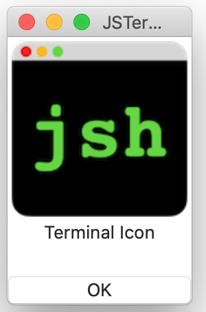

# Icon component
The icon which can be clicked.

## Syntax
````
icon: Icon {
  image:  String "terminal"
  title:  String "Terminal Icon"
  selected: Event() %{
    console.log("clicked") ;
  %}
}
````


You can see the sample script at [icon.jspkg](https://github.com/steelwheels/JSTerminal/tree/master/Resource/Sample/icon.jspkg).

## Property values
|Property name  |Type   |Description            |
|:--            |:--    |:--                    |
|image          |String |The name of image resource |
|title          |String |The title of the icon |

The value of `image` property must be described in manifest file. About the manifest file, see [JavaScript package](https://github.com/steelwheels/JSTools/blob/master/Document/jspkg.md).

## Methods
### `selected` event
The method with no parameters.
````
selected: Event() %{
   ...
%}
````

## Reference
* [Library](https://github.com/steelwheels/KiwiCompnents/blob/master/Document/Library.md): The list of components.
* [README](https://github.com/steelwheels/KiwiCompnents): Top page of KiwiComponents project.
* [Steel Wheels Project](https://steelwheels.github.io): Developer's web site


