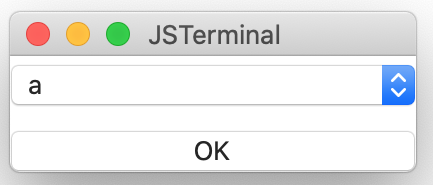

# PopupMenu Component

## Syntax
````
menu: PopupMenu {
  items: Array ["a", "b", "c"]
  //index: Int   0
  selected: Event(index) %{
    console.log("selected = " + index) ;
  %}
}
````



### Properties
|Name   |Type           |Description                        |
|:--    |:--            |:--                                |
|items  |Array<String>  |Array of menu items                |
|index  |Int            |Index of selected item (read only) |

Note: The `index` property is read only. You can declare the property but the value will not set.

### Event functions
#### `selected` event
The function which is called when the user select the menu item.

````
menu0: PopupMenu {
    selected: Event(index) %{
    %}
}
````

#### Parameter(s)
|Name   |Type   |Description        |
|:--    |:--    |:--                |
|index  |Int    |Index of array of selected item   |

## Related links
* [Library](https://github.com/steelwheels/KiwiCompnents/blob/master/Document/Library.md): The list of components. 
* [README](https://github.com/steelwheels/KiwiCompnents): Top page of KiwiComponents project.
* [Steel Wheels Project](https://steelwheels.github.io): Developer's web site
