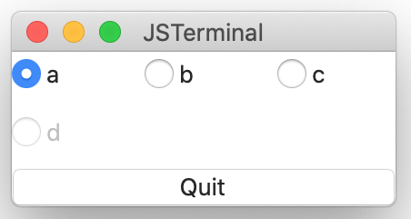

# RadioButtons component
The button to select one from multiple items.

## Sample
````
top: VBox {
    radio0: RadioButtons {
        labels:      Array      [
                {title:"title-0", id: 0},
                {title:"title-1", id: 1}
                ...
        ]
        isEnabled:   Array      [true, true, true, false]
        columnCount: Int        3
        selected: Event(newidx: number | null) %{
                console.print("new-index: " + newidx + "\n") ;
        %}
    }
    ...
}
````

You can see the full implementation at [radio-button.jspkg](https://github.com/steelwheels/JSTerminal/tree/master/Resource/Sample/radio-button.jspkg).



## Properties

|Property name  |Type       |Description        |
|:--            |:--        |:--                |
|labels         |`Label`    |Labels of radio buttons. It has label title (string) and label id (integer). The label id will be used as a parameter for `selected` event.|
|isEnabled      |boolean[]    |Activate/inactivate the  corresponded button. If this is not given, all buttons will be enabled. |

The `Label`  is an object. The parameter is array of them:
````
[
 {field: "label-name0", id: 0 },
 {field: "label-name1", id: 1 },
 {field: "label-name2", id: 2 }
]
````
Multiple labels can have any ids:

## Methods
### `selected` event
This method will be called when the radio button is pressed by the user.
````
selected: Event(labid: number | null) %{
        ... event processing ...
%}
````

The parameter `newidx` is the label id of selected radio button or `null` when there are no selected buttons.

## Reference
* [Library](https://github.com/steelwheels/KiwiCompnents/blob/master/Document/Library.md): The list of components. 
* [README](https://github.com/steelwheels/KiwiCompnents): Top page of KiwiComponents project.
* [Steel Wheels Project](https://steelwheels.github.io): Developer's web site


