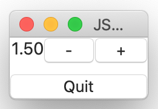

# Stepper component
The controller which to give the limited number.

## Syntax
````
 stepper0: Stepper {
  maxValue:        Float   10.0
  minValue:        Float   0.0
  deltaValue:      Float   0.1
  currentValue:    Float   1.0
  decimalPlaces:   Int     2
  isIncrementable: Bool    true
  isDecrementable: Bool    true
  changed: Event(newval) %{
    console.log("changed: " + newval) ;
  %}
}
````



You can find the full implementation of above script at [stepper.jspkg](https://github.com/steelwheels/JSTerminal/tree/master/Resource/Sample/stepper.jspkg).

## Property values
|Property name  |Type   |Description        |
|:--            |:--    |:--                |
|maxValue       |number |Maximum limit of the value |
|minValue       |numner |Minimum limit of the value |
|deltaValue     |number |Unit value for step up and down |
|currentValue   |number |Current value (Read only except initialization) |
|decimalPlaces  |number |Number of decimal places. Whem this value is zero, the integer value will be displayed |
|isIncrementable |boolean |Activate/Inactivate the button to increment the current value    |
|isDecrementable |boolean |Activate/Inactivate the button to decrement the current value    |

## Methods
### `changed` event function
The `changed` event function will be called when the current value is changed.
````
changed: Event(newval: number): void %{
    console.log("changed: " + newval) ;
%}
````

|Parameter name |Type   |Description        |
|:--            |:--    |:--                |
|newval         |number |The current value (after latest step up or down) |

# Reference
* [Library](https://github.com/steelwheels/KiwiCompnents/blob/master/Document/Library.md): The list of components.
* [README](https://github.com/steelwheels/KiwiCompnents): Top page of KiwiComponents project.
* [Steel Wheels Project](https://steelwheels.github.io): Developer's web site


