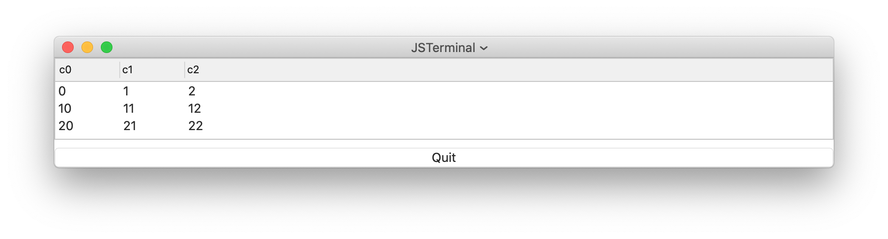

# Table component
The table is used to present the content of database. 
The content of the database is defined by table object.
See [ValueTable](https://github.com/steelwheels/KiwiScript/blob/master/KiwiLibrary/Document/Class/ValueTable.md),
[ContactTable](https://github.com/steelwheels/KiwiScript/blob/master/KiwiLibrary/Document/Class/ContactTable.md).

This is sample script and it's view:
````
top: VBox {
  table: Table {
	hasHeader:    Bool true
        isSelectable: Bool true
	fieldNames: Array [
		{field:"c0", title:"column 0"},
		{field:"c1", title:"column 1"},
		{field:"c2", title:"column 2"}
	]
	init: Init %{
                let storage = ValueStorage("storage") ;
	        if(storage == null){
		        console.log("Failed to allocate storage") ;
	        }
	        let table = ValueTable("data", storage) ;
	        if(table == null){
		        console.log("Failed to allocate table") ;
	        }
		// Set table into this view
                self.store(table) ;        
        %}
	pressed: Event(colname, rowidx) %{
                console.log("column_name = " + colname) ;
		console.log("row_index   = " + rowidx ) ;
		
	%}
  }
}
````



## Syntax

## Property values
|Property name  |Type   |Description        |
|:--            |:--    |:--                | 
|rowCount       |Int    |Number of rows in table (Reference only)|
|columnCount    |Int    |Number of columns in table (Reference only)|
|hasHeader      |Bool   |The visibility of column title view|
|isSelectable   |Bool   |You can select row or not |
|fieldNames     |Array  |Active field names |

The `fieldNames` property used to decide following thigs:
* Choose the fields in the record. These fields are displayed in the table.
* Set the column names for each field names. The column name is displayed in the header of the table.

The `fieldNames` is an array of following objects:
````
{
  field:  "c0"    // The string value for the field in record
  title:  "col0"  // The header name in the table
}
````

## Method

### `pressed`
The event method to accept clicked event:
````
pressed: Event(col: string, row: number) %{
%}
````
The parameter `col` is clicked column name.
The `row` is row number.

## Note
In the above example, the contents of [ValueTable](https://github.com/steelwheels/KiwiScript/blob/master/KiwiLibrary/Document/Class/ValueTable.md) is displayed in the view.
The value table uses [ValueStorage](https://github.com/steelwheels/KiwiScript/blob/master/KiwiLibrary/Document/Class/ValueStorage.md) to construct it.

# Reference
* [Library](https://github.com/steelwheels/KiwiCompnents/blob/master/Document/Library.md): The list of components. 
* [README](https://github.com/steelwheels/KiwiCompnents): Top page of KiwiComponents project.
* [Steel Wheels Project](https://steelwheels.github.io): Developer's web site

