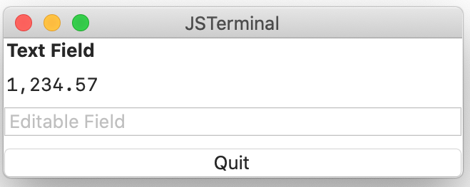

# TextField component
text field. You can choose editable or non-editable.

This is sample script and the view:
````
top: VBox {
    label_str: Label {
        text:     String   "Text Field"
        fontSize: FontSize large
    }
    label_int: Label {
        number:        Float 1234.567
        isEnabled:     Bool  false
        decimalPlaces: Int   2
    }
    edit_str: TextField {
        text:       String "Editable Field"
        isEnabled:  Bool   true
        isEditable: Bool   true
        edited: Event(str) %{
                console.log("edited result = " + str) ;
        %}
    }
    quit_button: Button {
        title: String "Quit"
        pressed: Event() %{
                leaveView(1) ;
        %}
    }
}
````


You can find the entire example at [text-field-1.jspkg](https://github.com/steelwheels/JSTerminal/tree/master/Resource/Sample/text-field.jspkg).

## Syntax
## Property values
|Property name  |Type    |Description            |
|:--            |:--     |:--                    | 
|text           |string  |Set the string in the field |
|number         |numner  |Set the string describing it |
|fontSize       |[FontSize](https://github.com/steelwheels/KiwiScript/blob/master/KiwiLibrary/Document/Enum/FontSize.md) | Size of font |
|isEnabled      |boolean |Activate display |
|isEditable     |boolean |Set editable or not    |
|isBold         |boolean |Use bold font (text only) |
|decimalPlaces  |number  |Decimal places for floating point number |
|edited         |event   |The Event function (See the specification of [amber language](https://github.com/steelwheels/Amber/blob/master/Document/amber-language.md)) which is called when the context is edited. |

## Reference
* [Library](https://github.com/steelwheels/KiwiCompnents/blob/master/Document/Library.md): The list of components. 
* [README](https://github.com/steelwheels/KiwiCompnents): Top page of KiwiComponents project.
* [Steel Wheels Project](https://steelwheels.github.io): Developer's web site

